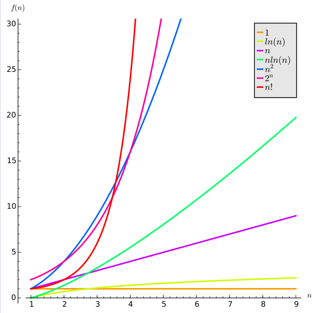
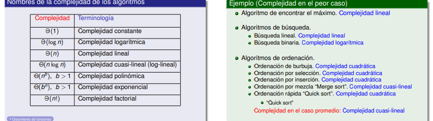
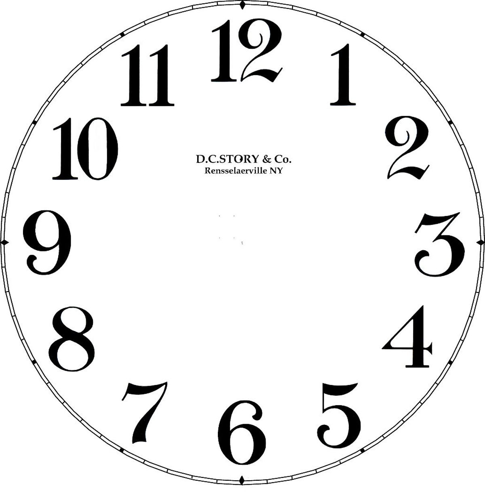
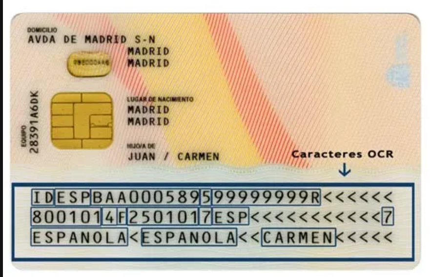
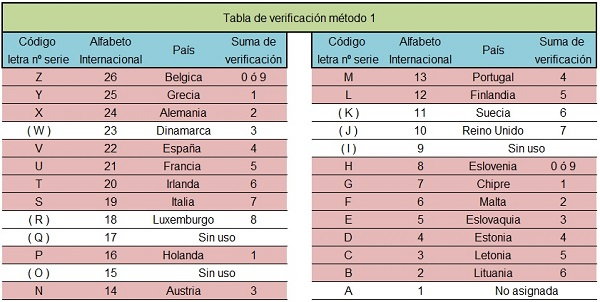

# Algoritmo

Sucesion finita de instrucciones precisas para realizar una tarea/calculo/resolver un problema

-   Instruccion **clara** y no amigua, ejecutable en tiempo **finito**
-   La sucesion de pasos sera claramente definida
-   El proceso termina en un numero finito de pasos
-   **Eficiente** --> tiempo polinomico

-   Propiedadades
    
    - **Input** --> elementos de un conjunto especificado
    - **Output** --> solucion del problema, elementos de un conjunto
    - **Definicion** --> de manera precisa
    - **Correccion** --> salidas correctas para cada conjunto de entrada
    - **Duracion finita** 
    - **Efectividad** --> cada paso con exactitud y en un intevalo finito de tiempo
    - **Generalidad** --> aplicable a todos los problemas

## Algoritmos de busqueda


### Lineal

Siendo $x$ el elemento a buscar y $[a_0,a_1,...,a_n]$ la lista donde buscar

Empezamos comparando $x$ y $a0$

- Si $x=a0$, la solucion es la posicion de $a_0$, es decir, $0$
- Si $x \ne 0$, se compara con el siguiente elemento($a_1$)
    - Si $x=a1$, la solucion es la posicion de $a_1 (1)$
    - Si $x \ne a1$ se compara con $a_2$

Este proceso se repite hasta encontrar una coincidencia, y la solucion sera la posicion
del termino donde se encuentre la coincidencia

Si se recorre toda la lista sin encontrar coincidencias con x, la solucion sera False

### Binaria

Siendo $x$ el elemento a buscar, y $[a_0,a_1,...a_n]$ una lista en orden creciente de tamaño

- Se comienza comparando $x$ con el elemento central de la lista($a_m$) $\lfloor \frac{len(lista)}{2} \rfloor$
    - Si $x>a_m$, la busqueda se restringe a la segunda mitad de la lista
    - Si $x\nless a_m$, la busqueda se restringe a la primera mitad de la lista

Siguiendo este proceso se van creando sublistas resultado de dividir la anterior a la mitad
hasta llegar  a una lista de un elemento, que se comprueba si ese elemento coincide con x

#### floor()
 
$floor: \mathbb{R} \longrightarrow \mathbb{Z}$

$\qquad\quad x \rightarrow \lfloor x \rfloor$

donde $floor(x)$ es el mayor entero $z$, $z \leq x$

#### ceil()

$ceil: \mathbb{R} \longrightarrow \mathbb{Z}$

$\qquad\quad x \rightarrow \lceil x \rceil$

donde $ceil(x)$ es el menor entero $z$, $z \geq x$


## Algoritmos vorazes (greedy) --> nuestro sistema monetario para el cambio de monedas

Consiste en seleccionar la mejor opcion en cada paso (solucion local) en lugar de considerar toda la secuencia
global de pasos que conducirian a lo optimo

Una vez q un algortimo greedy encuentre una solucion factible, se debe determinar si la solucion es optima

## Problemas indecidibles

- Problema de la parada

    No existe ningun metodo general que permita predecir, una vez el ordeandor haya comenzado
    el calculo, si dicho calculo terminara en una respuesta

# Notacion Big-O

Sean f y g funciones, 

$f,g: \mathbb{Z} \longrightarrow \mathbb{R}$ 

o

$f,g: \mathbb{R} \longrightarrow \mathbb{R}$ 


$f(x) \in (g(x)) si \exists constantes {C,k} > 0, \abs{f(x)} <= Cx\abs{g(x)} si x>k$

$O(g)$ son las funciones que **no crecen mas rapido** que $g$



## Teorema 1

Sea f(x) un polinomio de grado n --> f(x) es O(x^n)

## Teorema 2

Si f(x) es O(g(x)) y f'(x) es O(g'(x))

    (f+f')(x) es O(max{ |g(x)|, |g'(x)| }) 

### Corolario

    Si f(x) y f'(x) son O(g(x)) --> (f+f')(x) es O(g(x))

## Teorema 3

Si f(x) es O(g(x)) y f'(x) es O(g'(x))

    (f*f')(x) es O(g(x)*g'(x))

## Teorema 4 (prop transitiva)

Si f(x) es O(g(x)) y g(x) es O(h(x))

    f(x) es O(h(x))

## Teorema 5

Si f(x) es O(g(x))

    a.f(x) es O(g(x)) para cualquier constante a

# Complejidad en tiempo



- Problema tratable --> resoluble complejidad polinomica en el peor caso
- Problemna intratable --> no resoluble en complejidad polinomica en el peor caso

## Clase P

Resoluble por algortimo en tiempo polinomico

## Clase NP (nondeterministic polynomial)

Se puede checkear si una solucionm probable es realmente solucion en tiempo polinomico

- Torres de Hanoi
- El proboema de la factorizacion entera

## Clase NP-COMPLETO

Sus soluciones pueden obtenerse o no en tiempo polinomico

Si uno de sys problemas se puede resolver en tiempo polinomico en el peor caso,
entonces todos los problemas en la clase NP, tambien se pueden resolver en tiempo polinomico

- Candy Crush
- Problemadel viajante
- Problema de la mochiola

# Numeros Primos

Sea p un entero positivo >1, se dice que p es NUMERO PRIMO si sus divisores son 1 y p ==> {2,3,5,7,...}

Un numero entero positivo que no sea primo, es compuesto

a es unidad si (INVERSIBLE) ==> unidades de Z  = {-1,1}
        
    Existe b | a*b=1
               a=1/b


## Teorema (Euclides)

Existen infinitos numeros primos

## Primos de MERSENNE

2^p -1 con p primo, son primos
    
M1 --> $2^2 - 1 = 3$

    M2 --> 2^3 - 1 = 7
    M3 --> 2^5 - 1 = 31
    M4 --> 2^7 - 1 = 127
    NO --> 2^11 - 1 = 2047 (23*89) 
    M5 --> 2^13 - 1 = 8191
    M51 --> 2^82589933 -1

## Teorema fundamental de la aritmetica

Todo entero positivo >1 se puede factorizar de manera ÚNICA como un numero primo o producto de ellos, donde dos factores prioms estén escritos en orden  **no descendente** 

## Teorema (is_prime() ? )

Si n es un numero compuesto, n tiene un divisor primo <= que la raiz cuadrada de n

## Criba de Eratostenes

La criba de Eratóstenes es un algoritmo que permite hallar todos los números primos menores que un número natural dado. Se forma una tabla con todos los números naturales comprendidos entre 2 y n, y se van tachando los números que no son primos de la siguiente manera: Comenzando por el 2, se tachan todos sus múltiplos; comenzando de nuevo, cuando se encuentra un número entero que no ha sido tachado, ese número es declarado primo, y se procede a tachar todos sus múltiplos, así sucesivamente.

## Maximo Comun Divisor (a,b)

Sean a y b enteros positivos, al menos uno de ellos != 0, 
el mayor entero ```d | d/a && d/b``` se llama **gcd(a,b)**a

### Algoritmo de Euclides para hallar el gcd(a,b)

Complejidad logaritmica; **O(log(b))**

Sean a,b, a>=b

    a | b
      ---      gcd(a,b) == gcd(b,r)
    r   q    

- DEMOSTRACION

    Dado que ```a = qb + r```, sea d un divisor de a y de b --> ```d/r, a - qb = r```

- EJEMPLO
        
        662 | 414        gcd(662,414) = gcd(414,248)  = gcd(248,166) = gcd(166,82) = gcd (2,0) = 2
            -----       
        248   1

        414 | 248
            -----
        166   1

        248 | 166
            -----
        82   1

        166 | 82
            -----
        02   2

        82 | 2
            -----
        00   41


- PSEDOCODIGO
        
        x:=a
        y:=b

        while y!=0
            r:=x mod y
            x:=y
            y:=r
        
        return x --> {gcd(a,b)}

## Minimo Comun Multiplo (a,b)

Sean a y b enteros positivos, al menos uno de ellos !=0,
el menor entero ```m | a/m && b/m``` se llama **lcm(a,b)**

### Algoritmo de Euclides para hallar el lcm

Complejidad logaritmica, **O(log(b)**

    gcd(a,b)*lcm(a,b)=a*b
    lcm(a,b) = (a*b) / gcd(a,b)

## Teorema de BézoutG

Sean a,b enteros positivos, existen enteros s,t tal que:

    gcd(a,b) = s*a + t*b

### Algoritmo de Euclides para calcular coeficientes de Bezout(s,t)

    gcd(258,198)

    252 |198     198 |54     54  |36
        ----         ----        ----
    54   1       36   3    18     1
    
    54 = 252 - 198
    36 = 198 - 3*54
    18 = 54 - 36 = 54 - (198-3*54) = 4*54 - 198 = 4*(252-198)-198 = 4*252 - 5*198

    =======>  s = 4, t=5

## Relacion de primos entre si

Sean a,b enteros:

Son primos entre si (coprimos/relativmt primos entre si) si `gcd(a,b) = 1`

=====================

Sean a1,a2,...,an:

Son relativamente primos si `gcd(ai,aj) = 1 | i!=j`

### Lema 1

Si a,b,c son enteros positivos tal que:
    
    gcd(a,b) = 1, a/b*c --> a/c

### Lema 2

Si p primo y p/a1,a2,...,an; (ai son enteros):

==> ``p/ai`` para algun i

# Aritmetica modular ('aritmetica del reloj')

...---|-3|---|-2|---|-1|---|0|---|1|---|2|---|3|---...




Sean a,b enteros:

a es congruente con b (modulo m)

``a≡b (mod m) si a - b es multiplo de m --> m/(a-b)

- Ejemplo horas

        34 ≡ 10 (mod 12)
        34-10 = 24 --> 12/24

## Teorema

Sean a,b enteros, m entero positvo:
    
    a≡b (mod m) <-> a mod m = b mod m

    34 | 12     46 | 12
       -----       -----     ---> mismo resto (congruentes)
    10   2      10   3

    ------------------------------------------------------------

    a | m     b | m       a = q*m + r  }  a-b = (q*m + r) - (q'*m + r) = (q-q') * m
      -----     -----     b = q'*m + r }
    r   q     r   q'

## Teorema 

Sea m un entero positivo, si:
    
    a≡b (mod m) } --> a+c = b+d (mod m)
    c≡d (mod m) }     a*c = b*d (mod m)

Ejemplo m=12:
    
    a = 13   13≡25 (mod 12)
    b = 25

    c = 5    5≡17 (mod 12)
    d = 17

             13+5 = 18    18≡42 (mod 12)
             25+17 = 42

## Corolario

Sea m un entero positivo, a,b enteros

G    a+b (mod m ) = [(a mod m) + (b mod m)] mod m
    a*b (mod m ) = [(a mod m) * (b mod m)] mod m

## modulo m UNA ARITMETICA

    a + b := (a+b) (mod m)
      m

    a * b := (a*b) (mod m)
      m

    Z/mZ

    2*6 = 0 mod 12
    4*6 = 0 mod 12
    6*10 = 0 mod 12

En el reloj modulo 12, los unics numeros "buenos" son las unidades, (1,5,7,11)

    1*1 = 1 mod 12
    11*11 = 1 mod 12
    5*5 = 1 mod 12

**Las unidades de Z/mZ son las q son numeros primos relativos con m, y el resto, son "malos" (a*b≡0)**

**Si m es primo, todos los numeros son unidades**

### Cuantas unidades hay en Z/mZ? (inverso multiplicativo)

**PHI EULER (Φ(m))**

    m = p

    Φ(m) = p-1
    ___________________________________

    m = p^k 

    Φ(m) = (p^(k-1)) * (p-1)
 
    -----------------------------------

    m = p1^a1 * p2^a2 *, ... , ps^as

    Φ(m) = Φ(p1^a1) * ... * Φ(ps^as)

    Φ(12) = Φ(2^2) * Φ(3) = (2^(2-1)) * (3-1) = 2*2 = 4

## Ecuaciones lineales

ax ≡ b , Z/mZ

    2x ≡ 3 , mod 6 ==> no tiene solucion
    2x ≡ 4, mod 6 ==> x=2, x=5; DOS SOLUCIONES`

# (apuntes libreta)

# (criptografia pdf)


# Digitos de control

## DNI

La letra se calcula asignando una letra segun el resto mod(23) del numero



todos los numeros d deabjo son la informacion d ela parte de alante calculados mediatnte aritmetica modular, junto a unas cifra de control
(la que la gente dice que es el numero de personas con tu nombre)

## BILLETES

Numero de serie del billete (todo menos el ultimo digito, q es el numero de control)

- Serie 2002 (una letra + 10 digitos numero de control)
    
- Serie 2013 (dos letras + 10 digitos = numero de control)
    
Primera letra ==> pais emisor del billete

 

### Calculo digito de control

(para calcular el modulo de un numero de muchos digitos se van sumando las cifras u na a una y haciedno el modulo en cada una de ellas)
    
    38345 mod(9) = 3 + 8 = 11, mod(9) = 2; 2+3 5mod(9); 5+4=9(mod9) = 0; 0+5 = 5 mod(9)

**El complemento a 0 del resto mod(9) de los digitos (pasando las letras a numeros con ascii mod(9))**


## TARJETAS DE CREDITO (algoritmo de Luhm)

**digtos 1..16 (d1,..,d16)**

d16 = digito de control

- digitos pares (menos el d16) se multiplican por 1

- digitos impares se multiplican por 2

    - si el prodyucto tiene 2 digitos sus cifras se anaden

**el opuesto a 0 de las cifras ya multplicidadas y sumadas a mod(10) sera el digito de control**


# Representacion (expansion) de n en base b > 1

## Teorema 

Sea b un entero b>1

Si n es un entero positivo, entonces n se puede expresar de manera UNICA 
en la forma

```
n = (ak,a(k-1),...,a2,a1,a0)base b
```

donde k entero no negativo 0<=a-,a1,...,ak<b,ak!=0

```
b=2             BINARIO                 (10 1011)base 2
b=8             OCTAL                   (14 2371)base 8
b=16            HEXADECIMAL             {A=10, B=11, C=12, D=13, E=14, F=15}
b=2^7=128       ASCII
b=2^8=256       ASCII EXTENDIDO (UTF-8)
b=2^32          UTF-32
```
## base b ==> base b'

```
base2(10001) = 17

17 |9
   ---    ====>  17 = base9(18) = 8*9^0 + 1*9^1 = 17
 8  1
```
## Criterios divisibilidad = algpritmos para calcular restos de la division

```
n = 2       ak * 10^k +  ... + a2 * 10^2 + a1 * 10 + a0 = a0(mod2)  [10 elevado a algo es congruente con 0]

            54645 , resto: 5(mod2) = 1


n = 3       ak * 10^k +  ... + a2 * 10^2 + a1 * 10 + a0 = ak + ... + a2 + a1 + a0 (mod3)  [10 es congruente con 1] 

            781, resto: 7 + 8 + 1 (mod3) = 1


n = 4       ak * 10^k +  ... + a2 * 10^2 + a1 * 10 + a0 = 2a1 + a0 (mod4)

            676467 = 2*6 + 7 = 19(mod4) = 3


n = 5       ak * 10^k +  ... + a2 * 10^2 + a1 * 10 + a0 = a0 mod(5)   [10 elevado a algo es congruente con 0]
            
            56563, resto: 3(mod5) = 3


n = 6 = 2*3


n = 7       Un numero es divisinle por 7 si le quitais la ultima cifra, restais a lo que queda el doble de la ultima cifra

            781 --> 78 - 2 = 76 --> 7-12 = -5 congruente con 2 (mod7), no sirve para restos

            ak * 10^k +  ... + a2 * 10^2 + a1 * 10 + a0 =  a0 + 3a1 +2a2 -1a3 -3a4 -2a5(mod7) 


n = 8       ak * 10^k +  ... + a2 * 10^2 + a1 * 10 + a0 = 4*a2 + 2*a1 + a0 (mod8) --> a2*a1*a0 (mod8)


n = 0       ak * 10^k +  ... + a2 * 10^2 + a1 * 10 + a0 = ak + a2 + a1 + a0 (mod9) [10 es congruente con 1]


n = 11      ak * 10^k +  ... + a2 * 10^2 + a1 * 10 + a0 = (-1)^k * ak + ... + a4 -a3 +a2 -a1 +a0 (mod11) [10 es congriente con -1, al cuadrado con 1, al cubo con -1,...]

            5654234, resto: (4+2+5+5) - (3+4+6) mod(11) = 5-2 mod(11) = 3mod(11)
```

```


```


```

