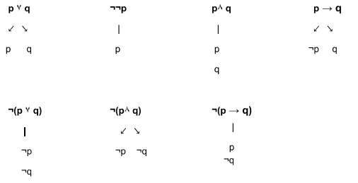

# Loxica booleana (V/F, nunca V e F)

## Calculo de proposicions

- **Alfabeto**: $p$ , $q$ , $r$ ,...
- **Conectores**: $\neg$ , $\land$ , $\lor$ , $\rightarrow$

1. Toda letra do alfabeto e unha proposicion
2. Sendo $a$ e $b$ proposicions
    1. $\neg a$ e outra proposicion
    2. $a\land b\quad a\lor b\quad a\rightarrow b$ son proposicions
3. Nada que non resulte das reglas anteriores e proposicion
4. Usanse parenteses para deixar clara a forma da proposicion

### Taboas de verdade (metodo NON recomendado)

| p | $\neg p$ |
| - | -------- |
| V | F |
| F | V |

| p | q | $p\lor q$ | $p\land q$ | $p\rightarrow q$ |
| - | - | --------- | ---------- | ------------- |
| V | V | V | **V** | V |
| V | F | V | F | **F** |
| F | V | V | F | V |
| F | F | **F** | F | V |

### Valores distinguidos (mellor opcion)

- $p\lor q$ : verdade se $p$ , $q$ verdade 
- $p\land q$ : falso se $p$ , $q$ falso
- $p\rightarrow q$ : falso se $p$ verdade e $q$ falso

#### Exemplo

$(p\land q)\rightarrow r$
```
   f
  / \
 v   f
/ \
v v
```

$(p\land q)\rightarrow r$ e falsa se $p$ ,$q$ verdade e $r$ falso

### "Tipos" de proposicions

 - **Tautoloxias( $\top$ )**: só poden ser verdade
 - **Contradicions**( $\bot$ ): so poden ser falsas
 - **Continxentes**: poden tomar ambos valores


### Consecuencias semanticas

$p\vDash q$ : $q$ é consecuencia semantica de $p$ cando para todos os casos onde $p$ é V, $q$ é V

se $p\vDash q$ , entón $p\rightarrow q\quad (\top)$

$p\vDash q$ e $q\vDash p$ son condicions necesarias para que $p\equiv q$

$\bot \vDash p, /forall p$

$p\vDash \top ,\forall p$

$\vDash p$ denota que $p$ e tautoloxia

- Se $p$ é cons. semantica de varias proposicions $p_1,p_2,...,p_k$
        
    - $\underline{p_1,p_2,...,p_k\vDash q}$
    - $\overline{\underline{p_1\land ...\land p_k\vDash q}}$
    - $\overline{\vDash (p_1\land ...\land p_k)\rightarrow q}$

### Regra da deducion

$p,p\rightarrow r \vDash r$

$p\rightarrow r \nvDash r$

De esta forma, $r$ é verdadeira en todos os casos, pois se fose falsa, non se cumpriria  a proposicion para $p$ verdadeira

**EXEMPLO**

- $\underline{\vDash ^? (\neg p \rightarrow q)\rightarrow [(\neg p \rightarrow \neg q)\rightarrow p]}$
- $\overline{\underline{\neg p \rightarrow q\vDash ^? (\neg p\rightarrow \neg q)\rightarrow p}}$
- $\overline{\neg p \rightarrow q, \neg p \rightarrow\neg q\vDash ^? p}$

- Esta consecuencia semantica so se cumple se $p$ e $q$ son verdadeiras

### Equivalencia semantica 

Mesmos valores de variables, proposicions con mesmos valores de verdade


$p\land q \equiv p\equiv p\lor q$

$p\rightarrow q\equiv \neg p \lor q$

$\neg (p\land q)\equiv \neg p \lor \neg q$

$\neg (p\lor q)\equiv \neg p \land \neg q$


$\underline{p\equiv q}$

$\overline{\vDash (p\rightarrow q)\land (q\rightarrow p)}$


$\underline{(p\lor q)\rightarrow r}$

$\overline{(p\rightarrow r)\land (q\rightarrow r)}$

### Arbores semanticas

#### Regras basicas



#### Demostrar unha contradicion
 


#### Demostrar a equivalencia de duas proposicions

**Tautoloxia = contradicion dunha negacion**

Enton, tendo en conta:

$\underline{p\equiv q}$

$\overline{\vDash (p\rightarrow q)\land (q\rightarrow p)}$

para comprobar que $p$ e $q$ son equiivalentes debemos comprobar que

$\neg [(p\rightarrow q)\land (q\rightarrow p)]\quad (\bot)\qquad$ (contradicion)

## Calculo de predicados

- Linguaxe
    - **Variables**: $x, y , z,...$
    - **Funcions**: $f,g,h,...$
    - **Predicados**: $P,Q,R,...$
    - **Conectores**: $\neg ,\rightarrow ,\land ,\lor$
    - **Cuantificadores**: $\forall ,\exists $

- **Aridade**: numero de elementos necesarios para dar significado ao q temos escrito
    - Pode ser calquer enteiro non negativo
    - As funcions **0-arias** chamanse constantes

- Termos
    - Variable
    - $f\quad$ funcion $n-aria$
        - $f\quad t_1,t_2,...,t_n$

- Formulas
    - $P\quad$ n-aria
    - $\alpha \beta$
    - $\alpha\quad$ formula
    
    - $\forall x \alpha\quad$   es formula

### Formulas (unha formula so e certa se os seus elementos foron interpretados para un universo)

- Universo ($\mathcal{U}$): numeros enteros (0,1,2,3,4,...)
- Interpretacion
    - $0^0$ : elemento de $\mathcal{U}$ que sea igual a 0
        - A partir de 0 elemenentos fabrica 1
    - $S^1$ : func. q transforma un elemento de $\mathcal{U}$ no seu seguinte
        - $x\implies sx$
    - $+^2$ : func q a partir de dous elementos crea outro distinto
        - $(x,y)\implies +(x,y)$
    - $<^2$ : verifica a existencia dun conx de 2 elementos nunha parte de $\mathcal{U} \times \mathcal{U}$

$\neg \forall x \alpha \equiv \exists x\neg \alpha$

- "Se no todos nacimos en Santiago, exist alguien q no nacio en Santiago"

$\neg \exists x\alpha \equiv \forall x\neg \alpha$

- "Si no existe alguien q naciera en Santaigo, nadie nacio en Santiago"

#### Exemplo de Universo (so fago un, na bitacora 5 hai dous mais)

$\mathcal{U} =$ Persoas da clase

- $P$: nacer en Pontevedra
- $O$: nacer en Ourense
- $L$: nacer en Lugo
- $C$: nacer na Coruña
- $A$: 2 persoas son amigas (pred binario)

"Todos os q naceron en Pontevedra teñen un amigo q non e de Ourense"
- $\mathcal{U} \vDash \forall x [P(x)\rightarrow \exists y (A(x,y)\land \neg O(y))]$

Para negar esto usamos $\neg \forall x\alpha \equiv \exists x \neg \alpha$

"Todos temos polo menos un amigo(podemos ser nos)"
- $\mathcal{U} \vDash \forall x \exists y A(x,y)$

"Cada un e amigo de si mesmo"
- $\mathcal{U} \vDash \forall x A(x,x)$

"Todos temos polo menos un amigo(non podemos ser nos)" (haberia q interpretar o '=')
- $\mathcal{U} \vDash \forall x \exists y A(x,y) \land \neg (x=y)$

#### Formulas certas en calquer universo

- Formula 1


$$\mathcal{U} \vDash \forall x(\alpha \rightarrow \beta)$$

$$\downarrow \downarrow \downarrow$$

$$\mathcal{U} \vDash \forall x \alpha \rightarrow \forall x\beta$$

Se o primeiro e verdade, o segundo o sera en todos os universos (ao invertilo non funciona)

**Comprobacion**


$$\underline{\neg (\forall x\alpha \rightarrow \forall x \beta)}$$

$$\underline{\overline{\forall x\alpha \land \neg \forall x \beta}}$$

$$\overline{\forall x\alpha \land \exists \neg \beta}$$

E dicir, todos os q teñen $\alpha$, teñen $\beta$

- Formula 2

$$\mathcal{U} \vDash \forall x (I(x)\rightarrow P(x))$$

$$\uparrow \uparrow \uparrow$$

$$\mathcal{U} \vDash \forall x \alpha \lor \forall x \beta$$

#### Desenvolvemento de formulas


# Teoria de Conxuntos

$x \in y\qquad$ "x é un elemento de y" (predicado binario)

$x \subseteq y\quad$ $\forall t (t\in x \rightarrow t\in y)$ "x contido en y" (subconxunto)

$x = y\quad$ $x\subseteq y \land y\subseteqq x$

## Operacions

- *Producto Cartesiano*
    - $A\times B = {(x,y) | x\in A \land y\in B)}$ 
- **Union**
    - $X\bigcup Y\qquad$  $t\in (X\bigcup Y)$ : $\quad t\in X \lor t\in Y$
- **Interseccion**
    - $X\bigcap Y\qquad$ $t\in (x\bigcap Y)$ : $\quad t\in X \land t\in Y$
- Conxunto baleiro
    - $\emptyset\qquad$ $forall x \neg(x\in \emptyset) \equiv \neg \exists x(x\in \emptyset)$

| simbolos conxuntos | equivalencias |
| ------------------ | ------------- |
| $\subseteq$ | $\rightarrow$ |
| $\cap$ | $\land$ |
| $\cup$ | $\lor$ |

## Demostraciones de conxuntos (mas ejemplos en bitacora 7)

$A\subseteq (A\cup B)\quad ¿?$

- $\forall x (x\in A) \rightarrow x\in (A\cup B) \quad \equiv \quad x\in A\lor x\in B$

$A\cup \emptyset = A\quad ¿?$

1. $A\subseteq (A\cup \emptyset)$
    - Certo polo exemplo anterior
2. $(A\cup \emptyset)\subseteq A$
    - $\forall x(x\in (A\cup \emptyset)\rightarrow x\in A)$
    - Para demostrar q e certo intentamos demostrar a falsedade da sua negacion
        -  $\neg \forall x(x\in (A\cup \emptyset)\rightarrow x\in A)$
        -  $\exists x \neg(x\in (A\cup \emptyset)\rightarrow x\in A)$
        -  $\exists x(x\in (A\cup \emptyset) \land \neg x\in A)x$
        -  $\exists x(x\in A\lor x\in \emptyset) \land \neg x\in A)x$
        -  $\exists x(x\in A \lor \neg x\in A)\land (x\in \emptyset \lor \neg x\in A)$
        -  Aqui atopamos unha contradicion

$A\backslash B$

- $x\in (A\backslash B) = x\in A \land x\notin B$
- Podemos agora asumir o conxunto C tal que
    - $\underline{x\in (A\backslash B) = x\in A \land x\notin B}$
    - $\overline{x\in A\backslash (B\cup C) = (A\backslash B)\cup (A\backslash C)}$
        - Demosracion de lo primero $\downarrow$
        - $\underline{x\in A\backslash (B\cap C)}$
        - $\overline{\underline{x\in A \land x\notin (B\cap C)}}$
        - $\overline{x\in A\land (x\notin B)\lor x\notin C}$
        
        - Demostracion grafica do segundo
        


## $P(A)$ : **PARTES DE A**

$|A| = n\rigtharrow |P(A)| = 2^n$
- $|A| es el cardinal, o numero de elementos de A$


- $x\in P(A):= x\subseteq A$
- $\emptyset=$ { }, pero $P(\emptyset) =$ { $\emptyset$ }

### Exercicio conxuntos vacios (mas ejemplos en ej. 4 del boletin (bitacora 12))

$\emptyset \in$ { $\emptyset$ } : correcto

{ $\emptyset$ }  $\in$ { $\emptyset,$ { $\emptyset$ }} : correcto

{ $\emptyset$ } $\subseteq$ { $\emptyset,$ { $\emptyset$ }} : correcto

### Exemplos de conxuntos con partes
$P(A) \cup P(B) = P(A\cup B) \quad ¿?$

1. $P(A) \cup P(B) \subseteq P(A\cup B) ¿?$
    - $x\in P(A)\cup P(B)$
        - $x\in P(A)\equiv x\subseteq A\implies x\subseteq (A\cup B)$
        - $x\in P(B)\equiv x\subseteq B\implies x\subseteq (A\cup B)$
    - x\in P(A\cup B) (1) e correcto)

2. $P(A\cup B)\subseteq P(A)\cup P(B) ¿?$
    - $x\in P(A\cup B)\equiv x\subseteq A\cup B$
        - Usamos un exemplo onde $A=$ { $1$ }, $B=$ { $2$ }
        - $P(A)=$ { $\emptyset$ , $A$ } $=$ { $\emptyset$ , $1$ }
        - $P(B)=$ { $\emptyset$ , $B$ } $=$ { $\emptyset$ , $2$ }
        - $A\cup B =$ { $1,2$ }
        - $P(A\cup B) =$ { $\emptyset$ ,{ $1$ },{ $2$ }, { $1,2$ }}
        - $P(A)\cup P(B)=$ { $\emptyset$ ,{ $1$ },{ $2$ }}
        - No caben todos los elementos de $A\cup B$ en $A\lor B$


